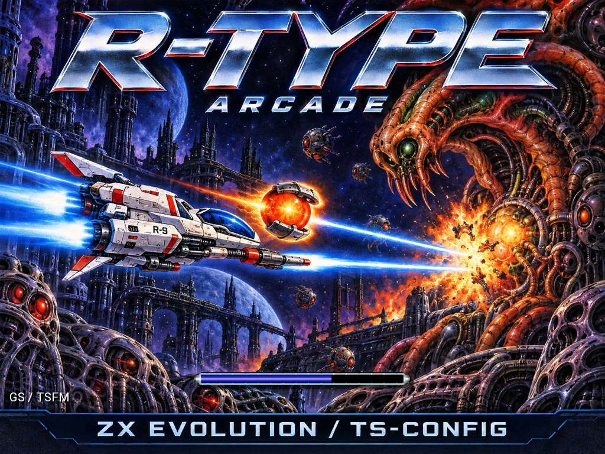

# R-Type VDAC2+

Порт **аркадного [R-Type](https://ru.wikipedia.org/wiki/R-Type) ([Irem M72](https://adb.arcadeitalia.net/dettaglio_mame.php?game_name=rtype), набор World)** на ZX Evolution с прошивкой TS-Config и
видеоадаптером VDAC2 ([FT812](https://brtchip.com/product/ft812/)). Игра однопользовательская и совпадает с оригиналом покадрово: при разработке
рабочее ОЗУ игры каждый кадр сверяется с эталоном — ROM автомата на эмуляторе [NEC V30](https://ru.wikipedia.org/wiki/NEC_V20) — байт в байт. Графика, данные и поведение
берутся только из ROM-дампа автомата и поведения оригинала в MAME.

**Версия 1.0** (27.09.2026, опорная v022). Готовые файлы для SD-карты — в [релизе 1.0](https://github.com/andrewinsidelazarev/R-Type-Arcade-VDAC2-FT812/releases/tag/v1.0).
Снимки экрана по уровням — в `Assets/Screenshots`.

## Что нужно

- ZX Evolution с TS-Config (Z80 14 МГц) и VDAC2 (FT812); монитор с режимом 1024×768 (≈59 Гц).
- SD-карта с FAT32.
- Звук: TurboSound FM (мелодии) и General Sound / ZX-MultiSound (эффекты). Без платы GS эффекты звучат на AY,
  мелодий нет.

## Что положить на карту

Папка `R-Type VDAC2` из архива релиза (она же — `Build/_SD/R-Type VDAC2/` в репозитории), удобнее целиком:

| Файл | Что это |
|---|---|
| `rtype_vdac2.spg` | загрузчик с экраном загрузки (≈0,5 МБ); его и запускать |
| `RTYPECOD.PAC` | код игры (≈2 МБ) |
| `RTYPELVL.PAC` | пак уровней (≈28 МБ): графика, фон, мелодии, эффекты |
| `README.TXT` | управление и звук, по-русски (cp1251) |

Загрузчик находит оба пака на карте по имени и размеру. Пак уровней меняется редко: с версии v013 он один и тот
же (SHA-256 `a80298f1e077b7d3…`).

## Загрузка

Экран загрузки — заставка во весь экран, шкала BEAM из панели игры и надпись звуковой схемы: `GS / TSFM` или
`AY (No GS)`. Под шкалой загрузчик читает код игры, открывает пак уровней и загружает звуки (сэмплы General Sound
или эффекты AY). Потом экран плавно уходит в чёрное, и сразу начинается титул. Если пак не найден, на экране
загрузки появляется `RTYPECOD.PAC NOT FOUND` или `RTYPELVL.PAC NOT FOUND`.

## Управление

- **Движение** — стрелки, Q/A/O/P, Kempston-джойстик или Kempston Mouse. Мышь ведёт корабль напрямую.
- **Огонь** — Space, Enter, огонь Kempston-джойстика или левая кнопка мыши. Удержание заряжает BEAM, как на
  автомате. Огонь же начинает игру с титула; старт есть и на восьмой кнопке Kempston-джойстика (бит 7 порта `#1F`),
  она только стартует игру.
- **Отделение и возврат Force** — правая кнопка мыши, правый Alt (AltGr) или вторая кнопка Kempston-джойстика
  (бит 5 порта `#1F`).
- **Скорость мыши** — средняя кнопка: 1x ↔ 0,5x, при запуске 1x. После переключения около трёх секунд в правом
  нижнем углу видна надпись `Mouse speed: 1x` или `Mouse speed: 0,5x`.
- Любая клавиша, огонь или левая кнопка мыши прерывают демо и возвращают титул. После GAME OVER игра тоже
  возвращается к титулу.

## Звук

Мелодии — на TurboSound FM (два [YM2203](https://ru.wikipedia.org/wiki/Yamaha_YM2203)): потоки переложены с [YM2151](https://ru.wikipedia.org/wiki/Yamaha_YM2151)
автомата. Эффекты — на [General Sound](https://ru.wikipedia.org/wiki/General_Sound): PCM записан с оригинала в MAME; в отличие от автомата,
эффекты не вытесняют друг друга по приоритету. Без платы GS эффекты идут на простой [AY](https://ru.wikipedia.org/wiki/AY-3-8910), а мелодии
не звучат.

## Как устроен порт

- **Состояние игры** — рабочее ОЗУ ROM (16 КБ) в исходной раскладке. Это договор о данных: благодаря ему каждый
  кадр сверяется с эталоном целиком.
- **Код.** Процедуры ROM переписаны на [Z80](https://ru.wikipedia.org/wiki/Zilog_Z80) вручную (журнал — `Docs/NATIVE_LEDGER.md`). То, что ещё не переписано,
  исполняет перевод машинного кода V30 в Z80, поэтому игра целая на каждом шаге. Титул и цикл кадров — это
  Python-версия порта (`Source/Python/rtype_port`, запуск на ПК — `run_python.cmd`), переведённая в Z80.
- **Графика.** Растр автомата 384×256 офлайн увеличен до 640×480 (xBRZ ×6, затем Lanczos) и лежит в паке
  уровней. Слои, спрайты, палитры и масштаб до 1024×768 делает FT812 (NEAREST); Z80 ничего не рисует.
- **Скорость.** Шаг игры привязан к кадру FT812: 59 Гц против 55 Гц автомата, то есть на 7,4 % быстрее.
  Но Z80 успевает в среднем 35,5 шага игры в секунду — около 65 % скорости автомата (модель реального времени,
  вся игра). Мелодии идут в реальном времени.

## Сборка

В репозиторий не входят ROM-дамп автомата и производные ассеты (`Assets/Converted`, `Assets/Original`), рабочая
папка `Build` (кроме `Build/_SD`), опорные хеши сверок и опорные версии. Для сборки из исходников нужен свой дамп
набора World в `Arcade/rtype` и конвейер ассетов (`build.cmd`, MAME 0.288).

`sh Source/Tools/vdac2p_rebuild.sh` — оболочка p2c, затем машина (перевод ROM, нативный код, видеоадаптер,
звук), экран загрузки, SPG и `RTYPECOD.PAC`, образ SD `Build/V30Z80/rtype_sd.img`. Файлы для карты копируются в
`Build/_SD/R-Type VDAC2/`. Пак уровней `RTYPELVL.PAC` собирает `Source/Tools/rtype_data.py`.
Архив для раздачи — эмулятор с образом SD и файлы для карты: `Source/Tools/vdac2p_package.py v022 27.09.2026`
(архив `R-Type VDAC2+ v022.zip` складывается в корень проекта и не публикуется).

Нужны:
- Python — зависимости в `E:\zx\R-Type VDAC2\Build\PythonDeps`, только на чтение;
- sjasmplus и spgbld — `E:\zx\z80\tsconf_project\exe`;
- SDCC — `E:\zx\sdcc`.

`build.cmd` — прежний конвейер VDAC2 (от проверки ROM до ассетов); пересборка VDAC2+ его не вызывает, готовые
ассеты уже лежат в `Assets/Converted` и `Audio/Converted`.

## Проверка

- Покадровая сверка с эталоном (память V30, вызовы платформы, звук, хеши вывода):
  `sh Source/Tools/vdac2p_wide.sh 70000 имя …` — вся игра сценарием автоогня;
  `sh Source/Tools/vdac2p_wide.sh 8000 имя --random 61 …` — случайный ввод: смерти, продолжения, конец игры.
  Полные команды — в `CLAUDE.md`.
- Скорость и показ кадров — модель реального времени `Source/Tools/vdac2p_realtime.py`.
- Загрузчик SPG — модель `Source/Tools/vdac2p_boot_check.py` (с платой GS и без).
- Картинка настоящего FT812 — эмулятор Unreal (bt8xxemu); на плате — проверка автора.

## Структура

| Каталог | Содержимое |
|---|---|
| `Arcade` | ROM-дамп автомата (только чтение; в репозиторий не входит) |
| `Assets/Converted` | готовые ассеты (в репозиторий не входят) |
| `Audio/Converted` | PCM эффектов для General Sound |
| `Assets/Screenshots` | снимки экрана по уровням, исходник заставки, картинка для соцсетей |
| `Source/ASM` | код Z80: машина, нативные процедуры, видеоадаптер, звук, загрузчики |
| `Source/C` | рантайм оболочки p2c |
| `Source/Python/rtype_port` | Python-версия, которую переводит сборка и запускает `run_python.cmd` |
| `Source/Tools` | сборка, пак, модели и сверки |
| `Baselines` | опорные хеши вывода для сверок (в репозиторий не входят) |
| `Docs` | журнал нативных процедур, карта ROM, TSLib |
| `Build` | артефакты сборки; в репозитории — только `Build/_SD`: готовые файлы для SD-карты |
| `pre-releases` | опорные версии: исходники, SPG и `RTYPECOD.PAC` (в репозиторий не входят) |

Правила проекта и устройство подробно — в `CLAUDE.md`, решения и замеры — в `PROJECT_MEMORY.md`.

## Ссылки

Автомат:
- [R-Type](https://ru.wikipedia.org/wiki/R-Type) и [Irem](https://ru.wikipedia.org/wiki/Irem) — Википедия; про плату M72 — в статье об игре.
- [R-Type (World) на Irem M72](https://adb.arcadeitalia.net/dettaglio_mame.php?game_name=rtype) — Arcade Database: набор ROM, железо, драйвер MAME.
- [Драйвер MAME `m72.cpp`](https://github.com/mamedev/mame/blob/master/src/mame/irem/m72.cpp) — устройство платы M72
  по коду эмулятора.

Микросхемы:
- [NEC V30](https://ru.wikipedia.org/wiki/NEC_V20) — процессор автомата (в Википедии — статья о NEC V20 и V30).
- [Yamaha YM2151](https://ru.wikipedia.org/wiki/Yamaha_YM2151) — звук автомата.
- [Zilog Z80](https://ru.wikipedia.org/wiki/Zilog_Z80) — процессор ZX Evolution; на автомате он же ведёт звук.
- [FT812](https://brtchip.com/product/ft812/) — видеоконтроллер VDAC2, серия EVE компании [FTDI](https://ru.wikipedia.org/wiki/FTDI) (теперь Bridgetek); отдельной статьи в
  Википедии нет, ссылка — на страницу производителя.
- [Yamaha YM2203](https://ru.wikipedia.org/wiki/Yamaha_YM2203) — два таких стоят в TurboSound FM.
- [AY-3-8910 / YM2149](https://ru.wikipedia.org/wiki/AY-3-8910) — звуковой чип AY.
- [General Sound](https://ru.wikipedia.org/wiki/General_Sound) — звуковая плата для эффектов.
